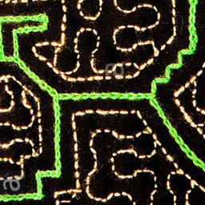

# Shipibo-GAN
Project using Generative Adversarial Networks to generate images of Shipibo tribe patterns and also 
make some animations.

The Shipibo is a tribe indigenous to South America. They are located somewhere deep in the Amazon 
forest and are threatened today by all of the trouble that this forest is having today.

The goal of this project was to leverage the Deep Learning architecture of Generative Adversarial 
Networks as presented by Ian Goodfellow in 2014. This sort of architecture has been greatly improved 
uppon in the past few years. Nvidia researches were able to generate super realistic images with 
architectures such as ProGAN and StyleGAN.

# 1) Collecting the Dataset

All of the data here was collected from an image scrapper that goes onto google images and retrieves a 
few hundred images per keyword. This yieled a dataset of aroun 900 images which I went onto clean by 
hand to reach around 400 good quality images. 

# 2) Data Preperation and Augmentation

The problem is that this dataset was nowhere near enough to be able to train a proper GAN on it. In 
order to greatly increase the amount of data I relied on some aggressive data augmentation techniques
in order to squeeze out as much data as possible. I had to sacrifice the high level details and symetry
of the original images in order to take a lot of random slices from the original picture which I would
then flip horizontally and vertically plus rotate 45°. With all this and taking enough slices would 
leave me with around 25 000 pictures. This is a very dramatic increase in terms of data but it was 
necessary to have a pretty aggressive data augmentation technique in order to get good results.

# 3) model training

This repository will hold a lot of the experimentation that went into making this project succesfull. I 
will most likely create a more compact repo with less elements and python code rather than notebooks 
once I have found how to to implement everything properly and have found the right architecture.

The models available here were insipired from the DCGAN architecture and follow a lot of the same 
principles from that model and paper.

V1 models were a big failure as they relied on the poor dataset and sadly never converged towards any intersting visuals

V2 models were better, I used the augmented image dataset which yielded greatly superior results compared to before. Here are some example pictures and gifs of the training process and end generated images.

